# 区块链技术在医院患者信息管理系统中的设计与实现

## 概要设计说明书

---

**文档版本**：V1.0  
**编写日期**：2026年3月  
**项目名称**：基于区块链的医院患者信息管理系统（Fabric-MIMS）  
**技术框架**：Hyperledger Fabric + Vue.js + Go  

---

## 目录

1. [系统体系结构](#1-系统体系结构)
2. [系统总体功能结构](#2-系统总体功能结构)
3. [运行环境](#3-运行环境)
4. [系统关键技术](#4-系统关键技术)
5. [功能模块列表](#5-功能模块列表)
6. [每个模块的功能描述](#6-每个模块的功能描述)
7. [操作者](#7-操作者)
8. [界面UI设计和说明](#8-界面ui设计和说明)
9. [输入信息列表](#9-输入信息列表)
10. [输出信息列表](#10-输出信息列表)
11. [模块下功能的时序图](#11-模块下功能的时序图)
12. [系统出错处理设计表](#12-系统出错处理设计表)
13. [补救措施](#13-补救措施)

---

# 1. 系统体系结构

## 1.1 系统架构概述

本系统采用**四层架构**设计，自下而上分别为：**数据存储层**、**区块链网络层**、**业务服务层**、**用户交互层**。

```
┌─────────────────────────────────────────────────────────────────────────────┐
│                           用户交互层 (Presentation Layer)                     │
│  ┌─────────────┐  ┌─────────────┐  ┌─────────────┐  ┌─────────────┐       │
│  │   管理员    │  │    医生     │  │    患者     │  │   访客      │       │
│  │   界面      │  │    界面     │  │    界面     │  │   界面      │       │
│  └─────────────┘  └─────────────┘  └─────────────┘  └─────────────┘       │
└─────────────────────────────────────────────────────────────────────────────┘
                                      │
                                      ▼
┌─────────────────────────────────────────────────────────────────────────────┐
│                           业务服务层 (Business Logic Layer)                   │
│  ┌──────────────────────────────────────────────────────────────────────┐   │
│  │                      Vue.js + Element UI 前端框架                      │   │
│  │  ┌──────────┐  ┌──────────┐  ┌──────────┐  ┌──────────┐            │   │
│  │  │ 用户管理  │  │ 病历管理  │  │ 授权管理  │  │ AI健康   │            │   │
│  │  │ 组件     │  │ 组件      │  │ 组件      │  │ 助手组件  │            │   │
│  │  └──────────┘  └──────────┘  └──────────┘  └──────────┘            │   │
│  └──────────────────────────────────────────────────────────────────────┘   │
│                                      │                                      │
│                                      ▼                                      │
│  ┌──────────────────────────────────────────────────────────────────────┐   │
│  │                      RESTful API 服务层 (Go/Gin)                      │   │
│  │  ┌──────────┐  ┌──────────┐  ┌──────────┐  ┌──────────┐            │   │
│  │  │ 用户接口  │  │ 病历接口  │  │ 授权接口  │  │ 门诊接口  │            │   │
│  │  └──────────┘  └──────────┘  └──────────┘  └──────────┘            │   │
│  └──────────────────────────────────────────────────────────────────────┘   │
└─────────────────────────────────────────────────────────────────────────────┘
                                      │
                                      ▼
┌─────────────────────────────────────────────────────────────────────────────┐
│                           数据存储层 (Data Storage Layer)                     │
│  ┌──────────────────────────────┐  ┌──────────────────────────────┐        │
│  │   World State (CouchDB)     │  │     Blockchain (账本)        │        │
│  │   当前状态数据库             │  │     完整交易历史              │        │
│  │   - 用户状态                │  │     - 区块链表                │        │
│  │   - 病历状态                │  │     - 交易记录                │        │
│  │   - 授权状态                │  │     - 事件日志                │        │
│  └──────────────────────────────┘  └──────────────────────────────┘        │
└─────────────────────────────────────────────────────────────────────────────┘
                                      │
                                      ▼
┌─────────────────────────────────────────────────────────────────────────────┐
│                        Hyperledger Fabric 区块链网络层                       │
│                                                                               │
│  ┌─────────────────────────────────────────────────────────────────────┐     │
│  │                          Orderer 排序服务                             │     │
│  │                        (交易排序 & 区块生成)                          │     │
│  └─────────────────────────────────────────────────────────────────────┘     │
│                                      │                                      │
│          ┌───────────────────────────┼───────────────────────────┐        │
│          ▼                           ▼                           ▼        │
│  ┌───────────────┐          ┌───────────────┐          ┌───────────────┐  │
│  │  Peer0 (医院)  │          │  Peer1 (医院)  │          │  Peer2 (管理)  │  │
│  │  Hospital Org  │          │  Hospital Org │          │  Admin Org    │  │
│  │  - 背书节点    │◄────────►│  - 背书节点    │◄────────►│  - 背书节点   │  │
│  │  - 提交节点    │          │  - 提交节点    │          │  - 提交节点   │  │
│  └───────────────┘          └───────────────┘          └───────────────┘  │
│                                                                               │
│  ┌─────────────────────────────────────────────────────────────────────┐     │
│  │                          Channel (通道)                              │     │
│  │                      appchannel - 业务数据通道                       │     │
│  └─────────────────────────────────────────────────────────────────────┘     │
│                                                                               │
└─────────────────────────────────────────────────────────────────────────────┘
```

## 1.2 系统体系结构图 (Mermaid)

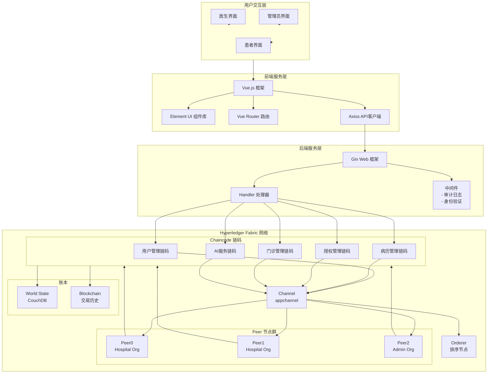

## 1.3 技术架构图

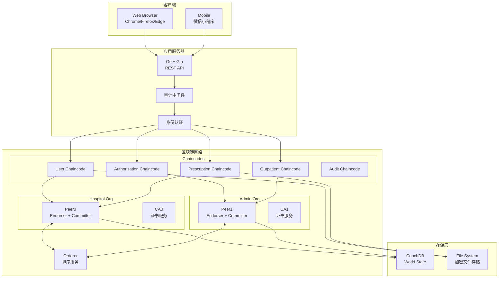

---

# 2. 系统总体功能结构

## 2.1 功能结构图 (Mermaid)

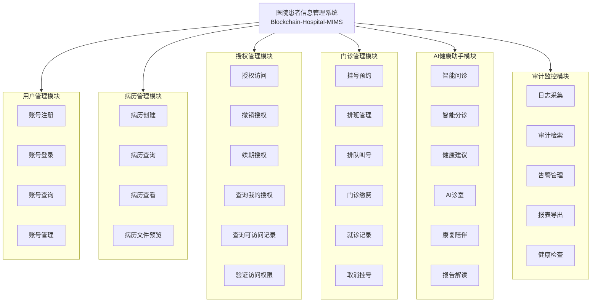

## 2.2 功能模块层级图

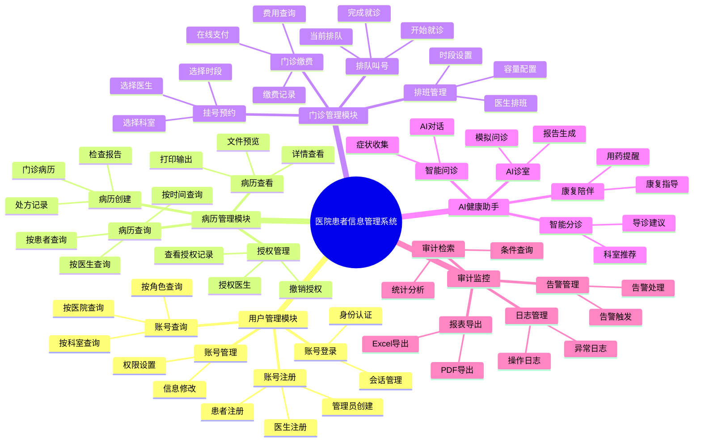

---

# 3. 运行环境

## 3.1 硬件环境

| 环境类型 | 配置要求 | 说明 |
|---------|---------|------|
| **开发工作站** | | |
| CPU | Intel Core i5 及以上 | 推荐 i7 |
| 内存 | 16GB 及以上 | 推荐 32GB |
| 硬盘 | 256GB SSD | 用于运行 Docker 镜像 |
| **服务器环境** | | |
| CPU | 8核及以上 | 推荐 16核 |
| 内存 | 32GB 及以上 | 推荐 64GB |
| 硬盘 | 500GB SSD | 存储区块链数据 |
| 网络 | 千兆网络 | 节点间通信 |
| **区块链节点** | | |
| 每个 Peer | 4核CPU, 8GB RAM | 建议独立部署 |
| 每个 Orderer | 4核CPU, 8GB RAM | 建议集群部署 |
| CouchDB | 4核CPU, 16GB RAM | 高可用部署 |

## 3.2 软件环境

### 3.2.1 基础软件

| 软件 | 版本要求 | 用途 |
|------|---------|------|
| Docker | 20.10+ | 容器化部署 |
| Docker Compose | 1.29+ | 服务编排 |
| Git | 2.30+ | 版本控制 |

### 3.2.2 开发语言环境

| 软件 | 版本要求 | 用途 |
|------|---------|------|
| Go | 1.18+ | 后端服务、链码开发 |
| Node.js | 16+ | 前端开发 |
| npm | 8+ | 前端包管理 |

### 3.2.3 区块链环境

| 软件 | 版本要求 | 用途 |
|------|---------|------|
| Hyperledger Fabric | 2.4+ | 区块链框架 |
| Fabric CA | 2.4+ | 证书授权服务 |
| Fabric SDK Go | 1.0+ | Go语言SDK |

### 3.2.4 前端环境

| 软件 | 版本要求 | 用途 |
|------|---------|------|
| Vue.js | 3.0+ | 前端框架 |
| Vue Router | 4.0+ | 路由管理 |
| Element Plus | 2.0+ | UI组件库 |
| Axios | 1.0+ | HTTP客户端 |

### 3.2.5 操作系统兼容性

| 操作系统 | 支持版本 | 说明 |
|---------|---------|------|
| Windows | Windows 10/11 | 开发环境 |
| Linux | Ubuntu 20.04+ | 服务器环境 |
| macOS | macOS 12+ | 开发环境 |

---

# 4. 系统关键技术

## 4.1 区块链技术

### 4.1.1 Hyperledger Fabric

| 特性 | 说明 |
|------|------|
| **框架类型** | 企业级联盟链 |
| **共识机制** | Raft 排序服务 |
| **智能合约** | Chaincode (Go/Node.js) |
| **通道隔离** | 支持多通道数据隔离 |
| **身份认证** | X.509 数字证书 + MSP |

### 4.1.2 核心概念

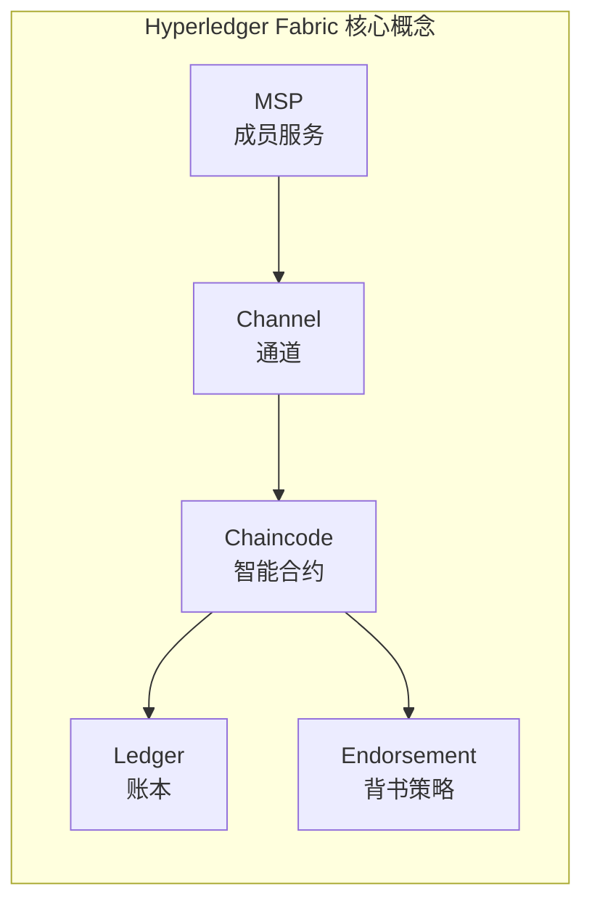

| 概念 | 说明 | 在本系统中的应用 |
|------|------|-----------------|
| **Channel** | 私有子网，隔离不同组织数据 | appchannel 业务通道 |
| **Chaincode** | 部署在区块链上的智能合约 | 用户、病历、授权链码 |
| **Ledger** | 包含World State和Blockchain | 存储所有业务数据 |
| **MSP** | 成员身份认证和管理 | 管理员、医生、患者身份 |
| **Endorsement Policy** | 交易背书规则 | 多数节点背书生效 |

## 4.2 密码学技术

| 技术 | 应用场景 |
|------|---------|
| **SHA-256** | 数据哈希、交易签名 |
| **ECDSA** | 数字签名 |
| **AES-256** | 文件加密存储 |
| **TLS/SSL** | 通信加密 |
| **X.509** | 数字证书 |

## 4.3 智能合约设计

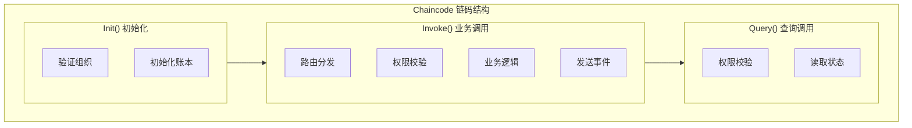

---

# 5. 功能模块列表

## 5.1 模块列表总表

| 序号 | 模块名称 | 所对应需求功能 | 实现优先级 |
|------|---------|---------------|-----------|
| 1 | 用户管理模块 | 用户注册、登录、身份认证、账号管理 | P0 - 核心 |
| 2 | 病历管理模块 | 病历创建、查询、查看、文件预览 | P0 - 核心 |
| 3 | 授权管理模块 | 授权访问、撤销授权、续期授权、可访问查询 | P0 - 核心 |
| 4 | 门诊管理模块 | 挂号预约、排班管理、排队叫号、门诊缴费 | P1 - 重要 |
| 5 | AI健康助手模块 | 智能问诊、智能分诊、AI诊室、报告解读 | P1 - 重要 |
| 6 | 审计监控模块 | 日志采集、审计检索、告警管理、报表导出 | P1 - 重要 |
| 7 | 保险报销模块 | 报销申请、报销查询、状态更新 | P2 - 扩展 |

## 5.2 模块优先级说明

| 优先级 | 说明 | 涵盖模块 |
|--------|------|---------|
| **P0 - 核心** | 系统运行必备功能 | 用户管理、病历管理、授权管理 |
| **P1 - 重要** | 提升系统价值功能 | 门诊管理、AI健康助手、审计监控 |
| **P2 - 扩展** | 未来扩展功能 | 保险报销 |

---

# 6. 每个模块的功能描述

## 6.1 用户管理模块

### 6.1.1 功能概述

| 项目 | 内容 |
|------|------|
| **模块名称** | 用户管理模块 (User Management) |
| **模块编号** | MOD-USER-001 |
| **功能数量** | 4个 |
| **优先级** | P0 - 核心 |

### 6.1.2 功能列表

| 功能编号 | 功能名称 | 功能描述 |
|---------|---------|---------|
| FUN-USER-001 | 账号注册 | 支持患者、医生两种角色的账号注册 |
| FUN-USER-002 | 账号登录 | 支持身份认证登录，颁发JWT Token |
| FUN-USER-003 | 账号查询 | 根据条件查询用户列表信息 |
| FUN-USER-004 | 账号管理 | 管理员可修改用户信息、角色权限 |

### 6.1.3 业务规则

- 患者注册需要提供：姓名、身份证号、联系方式、医保卡号（可选）
- 医生注册需要提供：姓名、身份证号、科室、职称、工号、医院信息
- 用户登录后生成JWT Token，有效期24小时
- 管理员可创建所有角色账号，普通用户只能注册患者角色

---

## 6.2 病历管理模块

### 6.2.1 功能概述

| 项目 | 内容 |
|------|------|
| **模块名称** | 病历管理模块 (Prescription Management) |
| **模块编号** | MOD-PRES-001 |
| **功能数量** | 4个 |
| **优先级** | P0 - 核心 |

### 6.2.2 功能列表

| 功能编号 | 功能名称 | 功能描述 |
|---------|---------|---------|
| FUN-PRES-001 | 病历创建 | 医生为患者创建门诊病历，包含诊断、处方等信息 |
| FUN-PRES-002 | 病历查询 | 按患者ID或医生ID查询病历列表 |
| FUN-PRES-003 | 病历查看 | 查看病历详细信息，支持权限校验 |
| FUN-PRES-004 | 病历文件预览 | 预览病历相关附件文件 |

### 6.2.3 业务规则

- 只有医生角色可以创建病历
- 病历创建后自动上链，生成唯一交易ID
- 患者只能查看自己的病历
- 医生查看患者病历需要患者授权
- 病历数据包含：主诉、现病史、既往史、过敏史、体格检查、诊断、治疗方案

---

## 6.3 授权管理模块

### 6.3.1 功能概述

| 项目 | 内容 |
|------|------|
| **模块名称** | 授权管理模块 (Authorization Management) |
| **模块编号** | MOD-AUTH-001 |
| **功能数量** | 6个 |
| **优先级** | P0 - 核心 |

### 6.3.2 功能列表

| 功能编号 | 功能名称 | 功能描述 |
|---------|---------|---------|
| FUN-AUTH-001 | 授权访问 | 患者授权指定医生访问自己的病历 |
| FUN-AUTH-002 | 撤销授权 | 患者撤销已授予的访问权限 |
| FUN-AUTH-003 | 续期授权 | 患者延长已授权的有效期 |
| FUN-AUTH-004 | 查询我的授权 | 患者查询自己发出的授权列表 |
| FUN-AUTH-005 | 查询可访问记录 | 医生查询自己可访问的患者病历 |
| FUN-AUTH-006 | 验证访问权限 | 验证医生是否有权访问指定病历 |

### 6.3.3 业务规则

- 只有患者角色可以发起授权
- 授权需要指定：患者ID、医生ID、病历ID（或全量授权）、有效期
- 默认授权有效期为7天
- 授权可随时撤销，撤销后医生立即失去访问权限
- 授权记录自动上链，可追溯

---

## 6.4 门诊管理模块

### 6.4.1 功能概述

| 项目 | 内容 |
|------|------|
| **模块名称** | 门诊管理模块 (Outpatient Management) |
| **模块编号** | MOD-OUT-001 |
| **功能数量** | 6个 |
| **优先级** | P1 - 重要 |

### 6.4.2 功能列表

| 功能编号 | 功能名称 | 功能描述 |
|---------|---------|---------|
| FUN-OUT-001 | 挂号预约 | 患者选择科室、医生、时段进行挂号 |
| FUN-OUT-002 | 排班管理 | 医生设置出诊时段和接诊容量 |
| FUN-OUT-003 | 排队叫号 | 显示当前排队情况，支持叫号操作 |
| FUN-OUT-004 | 门诊缴费 | 患者查询待缴费项目并完成支付 |
| FUN-OUT-005 | 就诊记录 | 查询历史就诊记录 |
| FUN-OUT-006 | 取消挂号 | 患者取消未就诊的挂号记录 |

### 6.4.3 业务规则

- 挂号需要选择科室、医生、就诊日期、时段
- 每个时段有容量限制，超过容量不可挂号
- 挂号状态：待支付、已支付、已就诊、已取消
- 医生可设置每次出诊的接诊人数上限
- 缴费需要在就诊完成后进行

---

## 6.5 AI健康助手模块

### 6.5.1 功能概述

| 项目 | 内容 |
|------|------|
| **模块名称** | AI健康助手模块 (AI Health Assistant) |
| **模块编号** | MOD-AI-001 |
| **功能数量** | 6个 |
| **优先级** | P1 - 重要 |

### 6.5.2 功能列表

| 功能编号 | 功能名称 | 功能描述 |
|---------|---------|---------|
| FUN-AI-001 | 智能问诊 | AI对话式问诊，收集症状信息 |
| FUN-AI-002 | 智能分诊 | 根据症状推荐就诊科室 |
| FUN-AI-003 | 健康建议 | 提供健康管理建议和注意事项 |
| FUN-AI-004 | AI诊室 | 模拟医生问诊流程，生成问诊报告 |
| FUN-AI-005 | 康复陪伴 | 提供康复指导和用药提醒 |
| FUN-AI-006 | 报告解读 | 解读检查报告的关键指标 |

### 6.5.3 业务规则

- AI问诊仅作为辅助参考，不作为正式诊断
- AI分诊推荐科室，患者仍需自行选择
- AI会话记录保存在服务器端
- 支持多轮对话，记忆上下文
- 报告解读仅提供指标说明，不提供诊断

---

## 6.6 审计监控模块

### 6.6.1 功能概述

| 项目 | 内容 |
|------|------|
| **模块名称** | 审计监控模块 (Audit & Monitoring) |
| **模块编号** | MOD-AUDIT-001 |
| **功能数量** | 5个 |
| **优先级** | P1 - 重要 |

### 6.6.2 功能列表

| 功能编号 | 功能名称 | 功能描述 |
|---------|---------|---------|
| FUN-AUDIT-001 | 日志采集 | 自动采集所有API操作日志 |
| FUN-AUDIT-002 | 审计检索 | 支持多条件查询审计日志 |
| FUN-AUDIT-003 | 告警管理 | 触发和处理异常告警 |
| FUN-AUDIT-004 | 报表导出 | 导出审计报表（Excel/PDF） |
| FUN-AUDIT-005 | 健康检查 | 检查审计收集器运行状态 |

### 6.6.3 业务规则

- 所有API调用自动记录审计日志
- 日志包含：操作人、操作时间、操作类型、目标资源、结果
- 告警级别：信息、警告、错误、严重
- 管理员可查看所有审计日志
- 普通用户只能查看自己的操作记录

---

# 7. 操作者

## 7.1 角色定义

| 角色ID | 角色名称 | 角色代码 | 权限级别 |
|--------|---------|---------|---------|
| ROLE-001 | 管理员 | admin | 最高权限 |
| ROLE-002 | 医生 | doctor | 诊疗权限 |
| ROLE-003 | 患者 | patient | 个人数据权限 |

## 7.2 角色权限矩阵

| 功能模块 | 管理员 | 医生 | 患者 |
|---------|:------:|:----:|:----:|
| **用户管理** | | | |
| 账号注册 | ✓ | ✓ | ✗ |
| 账号登录 | ✓ | ✓ | ✓ |
| 账号查询 | ✓ | ✓ | ✓(仅本人) |
| 账号管理 | ✓ | ✗ | ✗ |
| **病历管理** | | | |
| 病历创建 | ✗ | ✓ | ✗ |
| 病历查询 | ✓ | ✓(已授权) | ✓(本人) |
| 病历查看 | ✓ | ✓(已授权) | ✓(本人) |
| 病历文件预览 | ✓ | ✓(已授权) | ✓(本人) |
| **授权管理** | | | |
| 授权访问 | ✗ | ✗ | ✓ |
| 撤销授权 | ✗ | ✗ | ✓ |
| 续期授权 | ✗ | ✗ | ✓ |
| 查询我的授权 | ✗ | ✗ | ✓ |
| 查询可访问记录 | ✗ | ✓ | ✗ |
| 验证访问权限 | ✓ | ✓ | ✓ |
| **门诊管理** | | | |
| 挂号预约 | ✗ | ✗ | ✓ |
| 排班管理 | ✓ | ✓ | ✗ |
| 排队叫号 | ✗ | ✓ | ✗ |
| 门诊缴费 | ✗ | ✗ | ✓ |
| 就诊记录 | ✓ | ✓ | ✓ |
| 取消挂号 | ✗ | ✗ | ✓ |
| **AI健康助手** | | | |
| 智能问诊 | ✗ | ✓ | ✓ |
| 智能分诊 | ✗ | ✓ | ✓ |
| **审计监控** | | | |
| 审计检索 | ✓ | ✗ | ✗ |
| 告警管理 | ✓ | ✗ | ✗ |
| 报表导出 | ✓ | ✗ | ✗ |

## 7.3 操作者说明

### 7.3.1 管理员 (Admin)

```
┌─────────────────────────────────────────────────────────┐
│                      管理员操作范围                      │
├─────────────────────────────────────────────────────────┤
│                                                         │
│  ✓ 系统管理                                              │
│    - 账号创建、修改、删除                                │
│    - 角色权限配置                                        │
│    - 系统参数设置                                        │
│                                                         │
│  ✓ 审计监控                                              │
│    - 查看所有操作日志                                    │
│    - 管理告警信息                                        │
│    - 导出审计报表                                        │
│                                                         │
│  ✓ 数据统计                                              │
│    - 系统使用统计                                        │
│    - 业务数据分析                                        │
│                                                         │
└─────────────────────────────────────────────────────────┘
```

### 7.3.2 医生 (Doctor)

```
┌─────────────────────────────────────────────────────────┐
│                      医生操作范围                        │
├─────────────────────────────────────────────────────────┤
│                                                         │
│  ✓ 诊疗工作                                              │
│    - 创建门诊病历                                        │
│    - 查看已授权患者病历                                  │
│    - 开具处方                                            │
│                                                         │
│  ✓ 门诊管理                                              │
│    - 设置出诊排班                                        │
│    - 叫号接诊                                            │
│    - 完成就诊                                            │
│                                                         │
│  ✓ AI辅助                                                │
│    - AI问诊辅助                                          │
│    - 报告解读                                            │
│                                                         │
└─────────────────────────────────────────────────────────┘
```

### 7.3.3 患者 (Patient)

```
┌─────────────────────────────────────────────────────────┐
│                      患者操作范围                        │
├─────────────────────────────────────────────────────────┤
│                                                         │
│  ✓ 个人健康管理                                          │
│    - 查看个人病历                                        │
│    - 授权医生访问                                        │
│    - 撤销/续期授权                                       │
│                                                         │
│  ✓ 就医服务                                              │
│    - 挂号预约                                            │
│    - 在线缴费                                            │
│    - 查看就诊记录                                        │
│                                                         │
│  ✓ AI服务                                                │
│    - AI智能问诊                                          │
│    - 健康咨询                                            │
│                                                         │
└─────────────────────────────────────────────────────────┘
```

---

# 8. 界面UI设计和说明

## 8.1 整体布局

```
┌─────────────────────────────────────────────────────────────────────────┐
│                              顶部导航栏                                   │
│  ┌──────┐                    ┌─────────────────────┐     ┌──────────┐    │
│  │ Logo │    医院名称        │    导航菜单          │     │ 用户信息 │    │
│  └──────┘                    └─────────────────────┘     └──────────┘    │
├─────────────────────────────────────────────────────────────────────────┤
│                                                                         │
│                              主内容区域                                   │
│                                                                         │
│  ┌───────────────────────────────────────────────────────────────────┐  │
│  │                                                                   │  │
│  │                      页面内容                                    │  │
│  │                                                                   │  │
│  │                                                                   │  │
│  │                                                                   │  │
│  │                                                                   │  │
│  └───────────────────────────────────────────────────────────────────┘  │
│                                                                         │
├─────────────────────────────────────────────────────────────────────────┤
│                              底部版权信息                                 │
└─────────────────────────────────────────────────────────────────────────┘
```

## 8.2 登录页面

```
┌─────────────────────────────────────────────────────────────────────────┐
│                                                                         │
│                     ┌─────────────────────────┐                        │
│                     │                         │                        │
│                     │      系统 Logo          │                        │
│                     │                         │                        │
│                     │   区块链医院信息系统     │                        │
│                     │                         │                        │
│                     │  ┌───────────────────┐  │                        │
│                     │  │  账号：           │  │                        │
│                     │  └───────────────────┘  │                        │
│                     │                         │                        │
│                     │  ┌───────────────────┐  │                        │
│                     │  │  密码：           │  │                        │
│                     │  └───────────────────┘  │                        │
│                     │                         │                        │
│                     │  ┌───────────────────┐  │                        │
│                     │  │     登  录        │  │                        │
│                     │  └───────────────────┘  │                        │
│                     │                         │                        │
│                     │  ┌───────────────────┐  │                        │
│                     │  │   注册新账号       │  │                        │
│                     │  └───────────────────┘  │                        │
│                     │                         │                        │
│                     └─────────────────────────┘                        │
│                                                                         │
└─────────────────────────────────────────────────────────────────────────┘
```

## 8.3 管理员首页

```
┌─────────────────────────────────────────────────────────────────────────┐
│  首页概览                                                                │
├─────────────────────────────────────────────────────────────────────────┤
│                                                                         │
│  ┌────────────┐  ┌────────────┐  ┌────────────┐  ┌────────────┐      │
│  │   用户总数  │  │   病历总数  │  │  今日挂号  │  │  待处理告警 │      │
│  │    1,234   │  │    5,678   │  │     89     │  │      5      │      │
│  └────────────┘  └────────────┘  └────────────┘  └────────────┘      │
│                                                                         │
│  ┌────────────────────────────────────────────────────────────────┐     │
│  │                       最近操作记录                              │     │
│  ├─────────────┬─────────────┬─────────────┬─────────────────┤     │
│  │   操作人     │   操作类型   │   操作时间  │    状态         │     │
│  ├─────────────┼─────────────┼─────────────┼─────────────────┤     │
│  │   张医生     │   创建病历   │  10:30:25  │    成功         │     │
│  │   李患者     │   授权访问   │  10:28:12  │    成功         │     │
│  │   王医生     │   挂号预约   │  10:25:00  │    成功         │     │
│  └────────────────────────────────────────────────────────────────┘     │
│                                                                         │
│  ┌───────────────────────────┐  ┌───────────────────────────────────┐  │
│  │      告警信息              │  │         系统状态                   │  │
│  │  ⚠ 5条待处理告警         │  │  ● 区块链网络：正常运行           │  │
│  │  ● 2条严重级别            │  │  ● 数据库：正常运行               │  │
│  │  ● 3条警告级别            │  │  ● API服务：正常运行              │  │
│  └───────────────────────────┘  └───────────────────────────────────┘  │
│                                                                         │
└─────────────────────────────────────────────────────────────────────────┘
```

## 8.4 医生工作台

```
┌─────────────────────────────────────────────────────────────────────────┐
│  医生工作台                                                              │
├─────────────────────────────────────────────────────────────────────────┤
│                                                                         │
│  ┌────────────────────────────────────────────────────────────────┐     │
│  │  快捷操作                                                        │     │
│  │  ┌──────────┐ ┌──────────┐ ┌──────────┐ ┌──────────┐          │     │
│  │  │ 创建病历  │ │ 查看患者  │ │  AI问诊  │ │  叫号    │          │     │
│  │  └──────────┘ └──────────┘ └──────────┘ └──────────┘          │     │
│  └────────────────────────────────────────────────────────────────┘     │
│                                                                         │
│  ┌─────────────────────────────┐  ┌─────────────────────────────────┐  │
│  │     今日出诊信息              │  │       待接诊患者                  │  │
│  │  科室：内科                    │  │  ┌─────────────────────────┐   │  │
│  │  医生：张医生                  │  │  │ 1. 李明 - 内科 - 待接诊  │   │  │
│  │  时段：09:00-12:00            │  │  │ 2. 王芳 - 内科 - 待接诊  │   │  │
│  │  剩余号源：5/20               │  │  │ 3. 赵强 - 内科 - 待接诊  │   │  │
│  │                              │  │  └─────────────────────────┘   │  │
│  │  ┌────────────────────────┐ │  │                                  │  │
│  │  │     开始接诊            │ │  │                                  │  │
│  │  └────────────────────────┘ │  │                                  │  │
│  └─────────────────────────────┘  └─────────────────────────────────┘  │
│                                                                         │
│  ┌────────────────────────────────────────────────────────────────┐     │
│  │  最近接诊记录                                                    │     │
│  │  ┌──────────────────┬──────────────────┬──────────────────────┐ │     │
│  │  │ 患者姓名          │  就诊时间        │   操作               │ │     │
│  │  ├──────────────────┼──────────────────┼──────────────────────┤ │     │
│  │  │ 陈患者           │  2024-01-15 10:30│  [查看病历] [创建病历]│ │     │
│  │  └──────────────────┴──────────────────┴──────────────────────┘ │     │
│  └────────────────────────────────────────────────────────────────┘     │
│                                                                         │
└─────────────────────────────────────────────────────────────────────────┘
```

## 8.5 患者主页

```
┌─────────────────────────────────────────────────────────────────────────┐
│  患者首页                                                                │
├─────────────────────────────────────────────────────────────────────────┤
│                                                                         │
│  ┌────────────────────────────────────────────────────────────────┐     │
│  │  欢迎回来，张三！                                                │     │
│  └────────────────────────────────────────────────────────────────┘     │
│                                                                         │
│  ┌──────────────────────────────────────────┐ ┌─────────────────────┐  │
│  │  快速操作                                  │ │  AI健康助手          │  │
│  │  ┌──────────┐ ┌──────────┐ ┌──────────┐ │ │  ┌─────────────────┐│  │
│  │  │  挂号    │ │  查看病历 │ │ AI问诊  │ │ │  │                 ││  │
│  │  │  预约    │ │          │ │        │ │ │  │  有什么可以帮   ││  │
│  │  └──────────┘ └──────────┘ └──────────┘ │ │  │  到您的吗？     ││  │
│  │  ┌──────────┐ ┌──────────┐ ┌──────────┐ │ │  │                 ││  │
│  │  │  授权    │ │  门诊    │ │  保险    │ │ │  │  请描述您的     ││  │
│  │  │  管理    │ │  缴费    │ │  报销    │ │ │  │  症状...        ││  │
│  │  └──────────┘ └──────────┘ └──────────┘ │ │  └─────────────────┘│  │
│  └──────────────────────────────────────────┘ └─────────────────────┘  │
│                                                                         │
│  ┌─────────────────────────────┐  ┌─────────────────────────────────┐  │
│  │     最近病历                │  │       待缴费                     │  │
│  │  ┌─────────────────────┐   │  │  ┌─────────────────────────────┐ │  │
│  │  │ 1. 内科 - 张医生    │   │  │  │ 1. 门诊挂号费 - ¥50        │ │  │
│  │  │    2024-01-15      │   │  │  │    [立即支付]              │ │  │
│  │  │ 2. 眼科 - 李医生    │   │  │  └─────────────────────────────┘ │  │
│  │  │    2024-01-10      │   │  │                                  │  │
│  │  └─────────────────────┘   │  │                                  │  │
│  └─────────────────────────────┘  └─────────────────────────────────┘  │
│                                                                         │
└─────────────────────────────────────────────────────────────────────────┘
```

## 8.6 界面交互规范

| 规范类型 | 说明 |
|---------|------|
| **响应式布局** | 支持PC端和移动端访问 |
| **操作反馈** | 所有按钮操作必须有视觉反馈 |
| **加载状态** | 数据加载时显示loading动画 |
| **表单验证** | 提交前进行前端数据验证 |
| **错误提示** | 操作失败时显示友好的错误信息 |
| **分页展示** | 列表数据超过10条时分页显示 |

---

# 9. 输入信息列表

## 9.1 用户管理模块输入

| 序号 | 输入项名称 | 标识(字段) | 类型 | 有效范围 | 输入方式 |
|------|----------|-----------|------|---------|---------|
| 1 | 账号名 | account_name | String | 2-20个字符 | 文本输入 |
| 2 | 角色类型 | role | Enum | doctor/patient | 下拉选择 |
| 3 | 密码 | password | String | 6-20位字母数字 | 密码输入 |
| 4 | 姓名 | account_name | String | 2-50个字符 | 文本输入 |
| 5 | 性别 | gender | Enum | 男/女 | 单选按钮 |
| 6 | 年龄 | age | Number | 0-150 | 数字输入 |
| 7 | 身份证号 | id_card_no | String | 18位身份证格式 | 文本输入 |
| 8 | 联系电话 | phone | String | 11位手机号格式 | 文本输入 |
| 9 | 医保卡号 | insurance_card_no | String | 可选，医保格式 | 文本输入 |
| 10 | 所属医院 | hospital_id | String | 必填 | 下拉选择 |
| 11 | 所属科室 | department | String | 必填 | 下拉选择 |
| 12 | 职位职称 | title | String | 医生必填 | 文本输入 |
| 13 | 工号 | employee_no | String | 医生必填 | 文本输入 |

## 9.2 病历管理模块输入

| 序号 | 输入项名称 | 标识(字段) | 类型 | 有效范围 | 输入方式 |
|------|----------|-----------|------|---------|---------|
| 1 | 患者ID | patient | String | 必填，系统生成 | 下拉选择 |
| 2 | 主诉 | chief_complaint | String | 必填，1-500字 | 文本输入 |
| 3 | 现病史 | present_illness | String | 可选，长文本 | 富文本编辑 |
| 4 | 既往史 | past_history | String | 可选，长文本 | 富文本编辑 |
| 5 | 过敏史 | allergy_history | String | 可选 | 文本输入 |
| 6 | 家族史 | family_history | String | 可选 | 文本输入 |
| 7 | 体温 | temperature | Number | 35.0-42.0℃ | 数字输入 |
| 8 | 脉搏 | pulse | Number | 30-200次/分 | 数字输入 |
| 9 | 血压 | blood_pressure | String | 格式：收缩压/舒张压 | 文本输入 |
| 10 | 呼吸 | respiration | Number | 8-40次/分 | 数字输入 |
| 11 | 体格检查 | physical_exam | String | 可选 | 富文本编辑 |
| 12 | 实验室检查 | lab_exam | String | 可选 | 富文本编辑 |
| 13 | 影像检查 | imaging_exam | String | 可选 | 富文本编辑 |
| 14 | 诊断结果 | diagnosis_result | String | 必填 | 文本输入 |
| 15 | 治疗方案 | treatment_plan | String | 必填 | 富文本编辑 |
| 16 | 用药建议 | medication_advice | String | 可选 | 富文本编辑 |
| 17 | 医嘱 | doctor_advice | String | 可选 | 文本输入 |
| 18 | 病历类型 | record_type | Enum | EMR/REPORT/PRESCRIPTION | 下拉选择 |
| 19 | 备注 | comment | String | 可选 | 文本输入 |

## 9.3 授权管理模块输入

| 序号 | 输入项名称 | 标识(字段) | 类型 | 有效范围 | 输入方式 |
|------|----------|-----------|------|---------|---------|
| 1 | 患者ID | patient_id | String | 必填，当前登录用户 | 系统获取 |
| 2 | 医生ID | doctor_id | String | 必填 | 下拉选择 |
| 3 | 病历ID | record_id | String | 可选（空=全量授权） | 下拉选择 |
| 4 | 医院名称 | hospital_name | String | 必填 | 下拉选择 |
| 5 | 科室 | department | String | 必填 | 下拉选择 |
| 6 | 授权截止时间 | end_time | DateTime | 必填，大于当前时间 | 日期选择 |
| 7 | 备注 | remark | String | 可选 | 文本输入 |
| 8 | 授权ID | auth_id | String | 撤销/续期时必填 | 系统获取 |

## 9.4 门诊管理模块输入

| 序号 | 输入项名称 | 标识(字段) | 类型 | 有效范围 | 输入方式 |
|------|----------|-----------|------|---------|---------|
| 1 | 患者ID | patient_id | String | 必填 | 系统获取 |
| 2 | 医生ID | doctor_id | String | 必填 | 下拉选择 |
| 3 | 科室ID | department_id | String | 必填 | 下拉选择 |
| 4 | 时段ID | slot_id | String | 必填 | 下拉选择 |
| 5 | 就诊日期 | visit_date | Date | 必填，不能是过去日期 | 日期选择 |
| 6 | 挂号ID | registration_id | String | 取消挂号时必填 | 系统获取 |
| 7 | 操作人ID | operator_id | String | 取消操作时必填 | 系统获取 |
| 8 | 缴费ID | payment_id | String | 支付时必填 | 系统获取 |
| 9 | 支付渠道 | pay_channel | Enum | wechat/alipay/card | 下拉选择 |

## 9.5 AI健康助手模块输入

| 序号 | 输入项名称 | 标识(字段) | 类型 | 有效范围 | 输入方式 |
|------|----------|-----------|------|---------|---------|
| 1 | 用户ID | user_id | String | 必填 | 系统获取 |
| 2 | 会话ID | session_id | String | 继续对话时必填 | 系统获取 |
| 3 | 消息内容 | message | String | 必填，1-1000字 | 文本输入 |
| 4 | 会话类型 | type | Enum | chat/triage/rehab/report | 下拉选择 |

---

# 10. 输出信息列表

## 10.1 用户管理模块输出

| 序号 | 输出项 | 媒体 | 格式 | 数值范围/精度 | 输出量要求 | 示例 |
|------|-------|------|------|-------------|-----------|------|
| 1 | 账号列表 | 屏幕 | JSON数组 | 分页，每页10-50条 | 支持分页 | [{account_name: "张三", role: "patient"}] |
| 2 | 账号详情 | 屏幕 | JSON对象 | 单条完整信息 | 包含所有字段 | {account_name: "张三", phone: "138****8888"} |
| 3 | 登录凭证 | 屏幕/Header | Token字符串 | JWT格式，24小时有效 | 返回Token | eyJhbGciOiJIUzI1NiIsInR5cCI6IkpXVCJ9... |
| 4 | 操作结果 | 屏幕 | 状态码+消息 | 成功/失败 | 即时反馈 | {code: 200, message: "登录成功"} |

## 10.2 病历管理模块输出

| 序号 | 输出项 | 媒体 | 格式 | 数值范围/精度 | 输出量要求 | 示例 |
|------|-------|------|------|-------------|-----------|------|
| 1 | 病历列表 | 屏幕 | JSON数组 | 分页展示 | 支持分页、筛选 | [{id: "PR001", diagnosis: "感冒"}] |
| 2 | 病历详情 | 屏幕 | JSON对象 | 包含完整病历信息 | 包含所有检查项 | {chief_complaint: "发热2天", ...} |
| 3 | 病历文件 | 屏幕/下载 | PDF/图片 | Base64编码或URL | 支持预览和下载 | 文件预览或下载地址 |
| 4 | 交易哈希 | 屏幕 | String | 64位十六进制 | 创建病历时返回 | 0x8a7f9c3d... |

## 10.3 授权管理模块输出

| 序号 | 输出项 | 媒体 | 格式 | 数值范围/精度 | 输出量要求 | 示例 |
|------|-------|------|------|-------------|-----------|------|
| 1 | 授权列表(患者) | 屏幕 | JSON数组 | 当前用户发出的授权 | 支持状态筛选 | [{auth_id: "AUTH001", status: "granted"}] |
| 2 | 可访问列表(医生) | 屏幕 | JSON数组 | 医生可查看的病历 | 支持关键字搜索 | [{record_id: "PR001", patient_name: "张三"}] |
| 3 | 权限验证结果 | 屏幕 | Boolean | true/false | 即时返回 | {has_access: true} |
| 4 | 授权详情 | 屏幕 | JSON对象 | 包含授权所有信息 | 单条完整信息 | {patient_id: "...", doctor_id: "...", expires_at: "..."} |

## 10.4 门诊管理模块输出

| 序号 | 输出项 | 媒体 | 格式 | 数值范围/精度 | 输出量要求 | 示例 |
|------|-------|------|------|-------------|-----------|------|
| 1 | 挂号列表 | 屏幕 | JSON数组 | 当前用户的挂号记录 | 支持状态筛选 | [{reg_id: "REG001", status: "paid"}] |
| 2 | 排班列表 | 屏幕 | JSON数组 | 医生出诊时段 | 支持日期范围 | [{slot_id: "S001", start_time: "09:00"}] |
| 3 | 排队信息 | 屏幕 | JSON对象 | 当前排队状态 | 实时更新 | {current: 5, total: 20, waiting_list: [...]} |
| 4 | 缴费清单 | 屏幕 | JSON数组 | 待缴费项目 | 按患者聚合 | [{item: "挂号费", amount: 50}] |
| 5 | 支付结果 | 屏幕 | JSON对象 | 包含支付状态和流水号 | 即时返回 | {pay_status: "success", trade_no: "..."} |

## 10.5 AI健康助手模块输出

| 序号 | 输出项 | 媒体 | 格式 | 数值范围/精度 | 输出量要求 | 示例 |
|------|-------|------|------|-------------|-----------|------|
| 1 | AI回复 | 屏幕 | JSON对象 | 对话式文本 | 实时返回 | {reply: "根据您的描述，建议挂内科"} |
| 2 | 分诊建议 | 屏幕 | JSON对象 | 推荐科室和原因 | 单次调用 | {department: "内科", reason: "症状匹配"} |
| 3 | 会话历史 | 屏幕 | JSON数组 | 消息列表 | 支持翻页 | [{role: "user", content: "..."}] |
| 4 | 问诊报告 | 屏幕/下载 | JSON对象/PDF | 模拟问诊结果 | 支持导出 | {symptoms: [...], suggestions: [...]} |

## 10.6 审计监控模块输出

| 序号 | 输出项 | 媒体 | 格式 | 数值范围/精度 | 输出量要求 | 示例 |
|------|-------|------|------|-------------|-----------|------|
| 1 | 审计日志列表 | 屏幕 | JSON数组 | 分页展示 | 支持多条件筛选 | [{event_type: "CREATE", event_time: "..."}] |
| 2 | 日志统计 | 屏幕 | JSON对象 | 聚合数据 | 按日期/类型统计 | {total: 1000, success: 950, fail: 50} |
| 3 | 告警列表 | 屏幕 | JSON数组 | 分页展示 | 支持状态筛选 | [{level: "WARNING", status: "pending"}] |
| 4 | 导出报表 | 文件下载 | Excel/PDF | 符合导出条件 | 支持批量导出 | report_20240115.xlsx |
| 5 | 健康状态 | 屏幕 | JSON对象 | 系统组件状态 | 实时检查 | {status: "OK", hash_chain_ok: true} |

---

# 11. 模块下功能的时序图

## 11.1 用户登录时序图

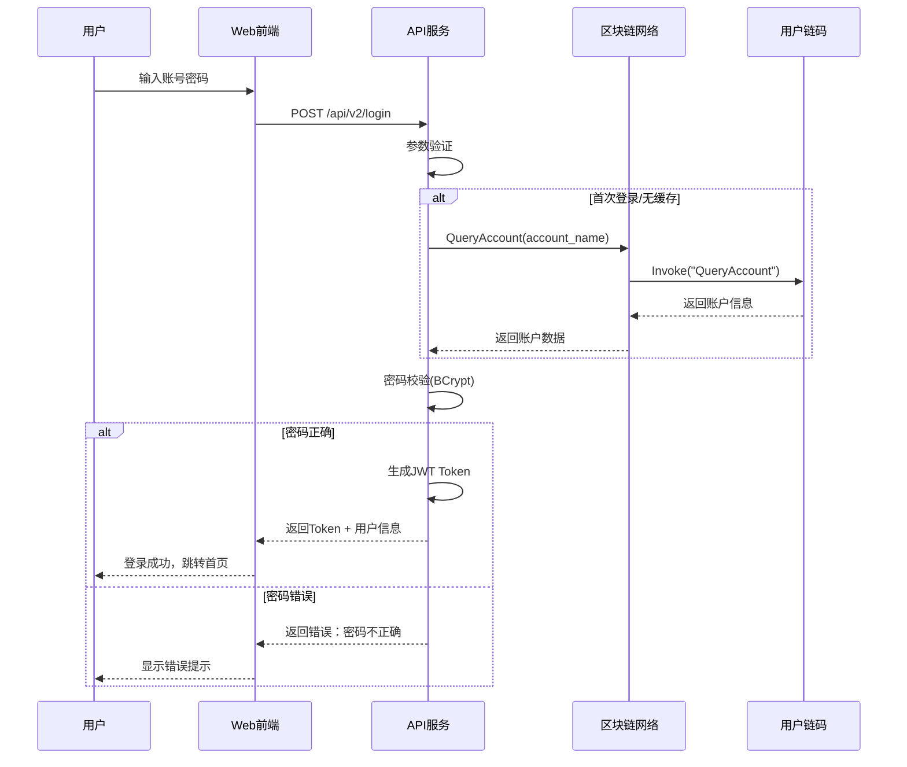

## 11.2 创建病历时序图

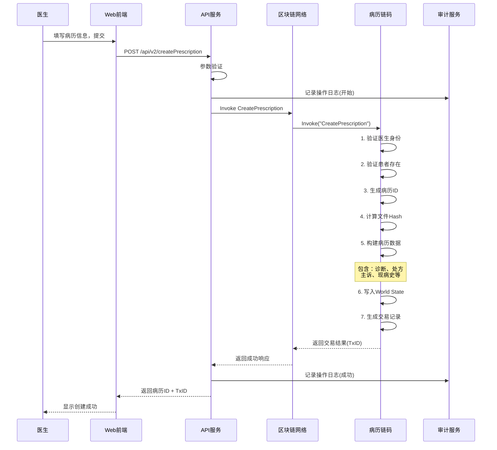

## 11.3 授权访问时序图

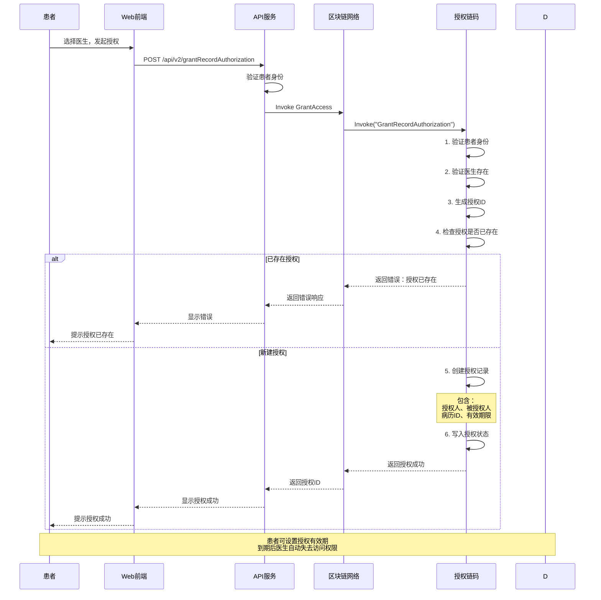

## 11.4 医生查询授权病历时序图

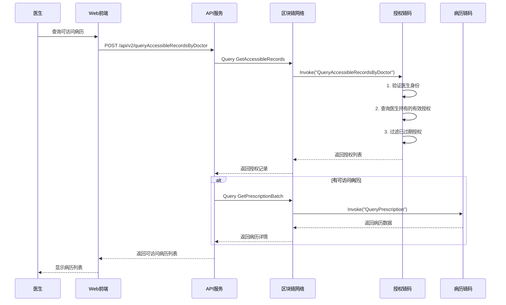

## 11.5 门诊挂号时序图

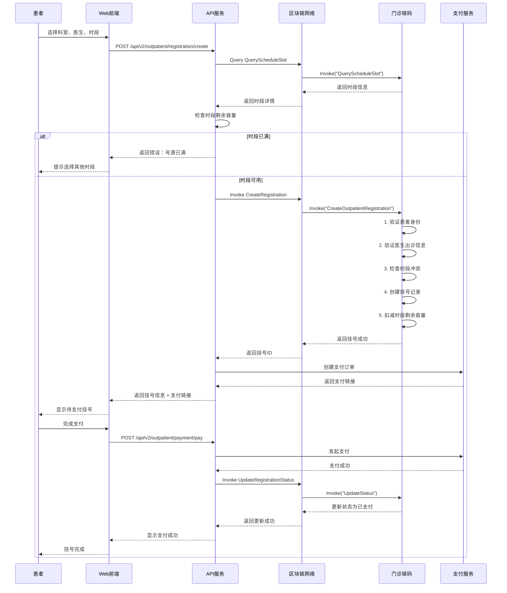

## 11.6 AI问诊时序图

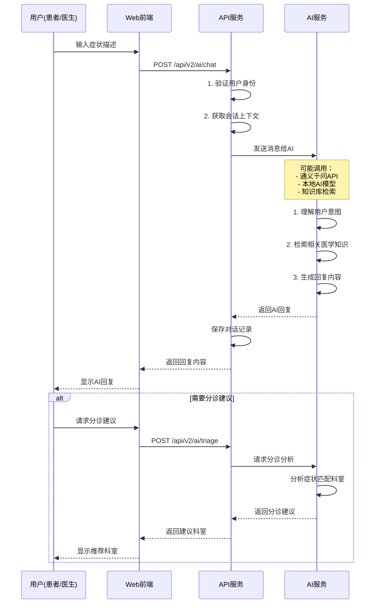

## 11.7 审计日志采集时序图

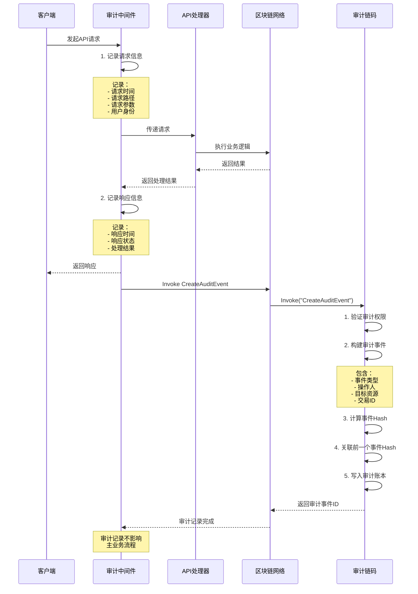

---

# 12. 系统出错处理设计表

## 12.1 用户管理模块出错处理

| 序号 | 出错或故障情况 | 系统输出信息 | 处理方式 |
|------|--------------|-------------|---------|
| 1 | 账号已存在 | "该账号已被注册，请使用其他账号" | 提示用户更换账号名 |
| 2 | 账号不存在 | "账号不存在，请检查输入" | 提示用户确认账号 |
| 3 | 密码错误 | "密码错误，请重新输入" | 提示重新输入，最多3次 |
| 4 | 密码连续错误 | "密码连续错误5次，账号已锁定30分钟" | 锁定账号，提示稍后重试 |
| 5 | Token过期 | "登录已过期，请重新登录" | 跳转登录页面 |
| 6 | Token无效 | "认证失败，请重新登录" | 跳转登录页面 |
| 7 | 权限不足 | "您没有权限执行此操作" | 提示联系管理员 |
| 8 | 必填字段为空 | "XXX为必填项，不能为空" | 高亮提示缺失字段 |
| 9 | 身份证格式错误 | "身份证号格式不正确" | 提示正确格式 |
| 10 | 手机号格式错误 | "手机号格式不正确" | 提示正确格式 |

## 12.2 病历管理模块出错处理

| 序号 | 出错或故障情况 | 系统输出信息 | 处理方式 |
|------|--------------|-------------|---------|
| 1 | 患者不存在 | "患者信息不存在" | 提示选择有效患者 |
| 2 | 医生不存在 | "医生信息不存在" | 提示选择有效医生 |
| 3 | 病历不存在 | "病历记录不存在" | 提示检查病历ID |
| 4 | 病历已创建 | "该患者已在此就诊时段创建病历" | 提示查看已有病历 |
| 5 | 权限不足 | "您没有权限查看该病历" | 提示患者授权 |
| 6 | 授权已过期 | "该授权已过期，请患者重新授权" | 提示联系患者续期 |
| 7 | 病历创建失败 | "病历创建失败，请重试" | 自动重试1次，失败则提示 |
| 8 | 区块链网络异常 | "区块链网络繁忙，请稍后重试" | 显示加载状态，等待后重试 |
| 9 | 文件上传失败 | "文件上传失败，请检查文件大小和格式" | 提示支持的格式和大小 |
| 10 | 交易超时 | "交易处理超时，请稍后查询结果" | 提示稍后刷新查看 |

## 12.3 授权管理模块出错处理

| 序号 | 出错或故障情况 | 系统输出信息 | 处理方式 |
|------|--------------|-------------|---------|
| 1 | 授权已存在 | "该医生已有访问授权" | 提示查看现有授权或续期 |
| 2 | 授权不存在 | "授权记录不存在" | 提示检查授权信息 |
| 3 | 授权已撤销 | "该授权已被撤销" | 提示患者重新授权 |
| 4 | 授权已过期 | "该授权已过期" | 提示续期授权 |
| 5 | 不能撤销他人授权 | "您只能撤销自己的授权" | 提示确认授权人 |
| 6 | 授权对象无效 | "授权的医生不存在" | 提示选择有效医生 |
| 7 | 有效期设置错误 | "授权截止时间必须晚于当前时间" | 提示修正时间 |
| 8 | 授权数量超限 | "该患者已授权过多医生" | 提示撤销不需要的授权 |
| 9 | 撤销失败 | "授权撤销失败，请重试" | 自动重试，失败则提示 |
| 10 | 批量授权失败 | "部分授权失败，请检查授权列表" | 显示成功/失败明细 |

## 12.4 门诊管理模块出错处理

| 序号 | 出错或故障情况 | 系统输出信息 | 处理方式 |
|------|--------------|-------------|---------|
| 1 | 时段已满 | "该时段号源已满，请选择其他时段" | 显示剩余号源 |
| 2 | 时段不可用 | "该时段暂不支持预约" | 提示查看可预约时段 |
| 3 | 日期不可预约 | "该日期不可预约" | 提示预约规则 |
| 4 | 重复挂号 | "您已挂过该时段的号" | 提示查看已有挂号 |
| 5 | 挂号不存在 | "挂号记录不存在" | 提示检查挂号信息 |
| 6 | 状态不允许操作 | "当前状态不允许此操作" | 提示允许的操作 |
| 7 | 支付超时 | "支付超时，请重新发起支付" | 保留挂号30分钟 |
| 8 | 支付失败 | "支付失败，请选择其他支付方式" | 提供其他支付渠道 |
| 9 | 退款失败 | "退款失败，请联系客服" | 记录工单，人工处理 |
| 10 | 取消超时 | "已过最晚取消时间" | 提示取消规则 |

## 12.5 AI服务模块出错处理

| 序号 | 出错或故障情况 | 系统输出信息 | 处理方式 |
|------|--------------|-------------|---------|
| 1 | AI服务不可用 | "AI服务暂时不可用，请稍后重试" | 显示降级提示 |
| 2 | AI响应超时 | "AI响应较慢，请稍等" | 显示加载动画，增加超时时间 |
| 3 | 输入内容违规 | "输入内容包含敏感词，请修改" | 提示修改输入 |
| 4 | 会话不存在 | "会话不存在或已过期" | 提示开始新会话 |
| 5 | 会话数量超限 | "会话数量超限，请结束旧会话" | 提示清理会话 |
| 6 | AI返回异常 | "AI返回内容异常，已过滤" | 返回安全内容 |
| 7 | 网络连接失败 | "网络连接失败，请检查网络" | 提供重试按钮 |
| 8 | 敏感信息泄露 | "检测到敏感信息，已自动脱敏" | 显示脱敏后的内容 |
| 9 | 分诊建议不确定 | "症状不足以给出准确分诊建议" | 引导补充症状描述 |
| 10 | 报告格式错误 | "报告格式无法解析" | 提示正确的报告格式 |

## 12.6 审计监控模块出错处理

| 序号 | 出错或故障情况 | 系统输出信息 | 处理方式 |
|------|--------------|-------------|---------|
| 1 | 日志查询失败 | "日志查询失败，请稍后重试" | 自动重试机制 |
| 2 | 导出文件过大 | "导出数据量过大，请缩小时间范围" | 提示分批导出 |
| 3 | 导出超时 | "导出超时，请缩小范围后重试" | 提供后台导出选项 |
| 4 | 磁盘空间不足 | "磁盘空间不足，无法完成导出" | 提示清理磁盘或联系管理员 |
| 5 | 告警规则冲突 | "告警规则冲突，已自动调整" | 显示调整后的规则 |
| 6 | 告警触发频繁 | "该告警触发过于频繁，已自动抑制" | 调整触发阈值 |
| 7 | 审计链断裂 | "检测到审计链异常，请检查" | 触发严重告警 |
| 8 | 日志存储满 | "审计日志存储已满，请清理历史数据" | 提示数据保留策略 |
| 9 | 权限验证失败 | "您没有权限查看审计日志" | 提示联系管理员 |
| 10 | 报表生成失败 | "报表生成失败，请重试" | 自动重试，记录失败原因 |

---

# 13. 补救措施

## 13.1 区块链网络异常补救

| 故障情况 | 预防措施 | 应急措施 | 恢复措施 |
|---------|---------|---------|---------|
| **单节点故障** | 多节点部署，负载均衡 | 自动切换到健康节点 | 故障节点自恢复或替换 |
| **网络分区** | 优化网络拓扑 | 暂停非关键业务 | 网络恢复后自动同步 |
| **Orderer不可用** | Raft多节点集群 | 切换到备用Orderer | 恢复Orderer服务 |
| **账本数据损坏** | 定期备份World State | 从其他节点同步数据 | 重建损坏节点 |
| **链码执行失败** | 交易超时设置 | 返回友好错误提示 | 重试或人工介入 |

## 13.2 应用服务异常补救

| 故障情况 | 预防措施 | 应急措施 | 恢复措施 |
|---------|---------|---------|---------|
| **API服务宕机** | 服务健康检查 | 切换到备用服务实例 | 重启服务 |
| **数据库连接池耗尽** | 连接池监控 | 释放空闲连接 | 优化连接配置 |
| **内存溢出** | 内存使用监控 | 触发GC或重启 | 分析内存泄漏 |
| **磁盘空间不足** | 磁盘使用告警 | 清理临时文件 | 扩容磁盘 |
| **服务雪崩** | 熔断器机制 | 限流保护 | 逐步恢复流量 |

## 13.3 数据异常补救

| 故障情况 | 预防措施 | 应急措施 | 恢复措施 |
|---------|---------|---------|---------|
| **数据不一致** | 事务机制保障 | 查询备用数据源 | 人工数据修复 |
| **数据丢失** | 多副本存储 | 从备份恢复 | 数据补录 |
| **敏感数据泄露** | 数据加密存储 | 立即更换密钥 | 通知受影响用户 |
| **恶意数据篡改** | 区块链不可篡改性 | 追溯篡改来源 | 恢复正确数据 |
| **历史数据损坏** | 定期归档备份 | 使用历史备份恢复 | 数据重建 |

## 13.4 安全事件补救

| 故障情况 | 预防措施 | 应急措施 | 恢复措施 |
|---------|---------|---------|---------|
| **账号被盗** | 多因素认证 | 立即冻结账号 | 重置密码和令牌 |
| **暴力破解** | 登录次数限制 | 锁定攻击IP | 升级安全策略 |
| **XSS攻击** | 输入过滤 | 清除恶意脚本 | 增强防护规则 |
| **CSRF攻击** | Token验证 | 清除攻击会话 | 增强CSRF防护 |
| **DDoS攻击** | 流量清洗 | 启用防护服务 | 溯源攻击来源 |

## 13.5 业务连续性保障

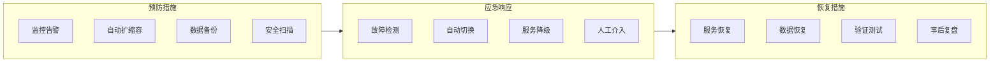

## 13.6 关键指标监控

| 监控指标 | 正常范围 | 告警阈值 | 处理措施 |
|---------|---------|---------|---------|
| API响应时间 | < 500ms | > 2000ms | 检查系统负载 |
| API成功率 | > 99.5% | < 99% | 检查错误日志 |
| 区块链交易延迟 | < 1s | > 5s | 检查网络和节点 |
| CPU使用率 | < 70% | > 85% | 扩容或优化 |
| 内存使用率 | < 75% | > 90% | 释放内存或扩容 |
| 磁盘使用率 | < 70% | > 85% | 清理或扩容 |
| 并发连接数 | < 1000 | > 2000 | 限流或扩容 |
| 错误率 | < 0.5% | > 2% | 检查异常日志 |

---

# 附录

## 附录A：术语表

| 术语 | 英文 | 说明 |
|------|------|------|
| 区块链 | Blockchain | 分布式账本技术，数据以区块形式链式存储 |
| Hyperledger Fabric | HLF | Linux基金会开发的企业级区块链框架 |
| 智能合约 | Smart Contract / Chaincode | 部署在区块链上的自动执行程序 |
| 通道 | Channel | Fabric中的私有子网，用于数据隔离 |
| 背书 | Endorsement | 交易验证机制 |
| MSP | Membership Service Provider | 成员身份认证服务 |
| World State | World State | 区块链账本的当前状态数据库 |
| RESTful API | REST API | 表述性状态转移接口 |
| JWT | JWT | JSON Web Token，用于身份认证 |
| 交易哈希 | TxID | 交易的唯一标识符 |

## 附录B：接口列表

| 模块 | 接口数量 | 主要接口 |
|------|---------|---------|
| 用户管理 | 3个 | 创建账号、查询账号、登录 |
| 病历管理 | 4个 | 创建病历、查询病历、预览文件 |
| 授权管理 | 6个 | 授权、撤销、续期、查询 |
| 门诊管理 | 12个 | 挂号、排班、缴费、排队 |
| AI服务 | 12个 | 问诊、分诊、报告解读 |
| 审计监控 | 11个 | 日志、告警、导出 |

## 附录C：数据库表（区块链World State）

| 表名 | 说明 | 主键 |
|------|------|------|
| Account | 用户账户 | account_id |
| Prescription | 病历记录 | prescription_id |
| Authorization | 授权记录 | authorization_id |
| Registration | 挂号记录 | registration_id |
| ScheduleSlot | 出诊时段 | slot_id |
| Payment | 缴费记录 | payment_id |
| AuditEvent | 审计事件 | event_id |
| Alert | 告警记录 | alert_id |

---

**文档结束**

*本文档为概要设计说明书，详细设计请参考详细设计文档。*
